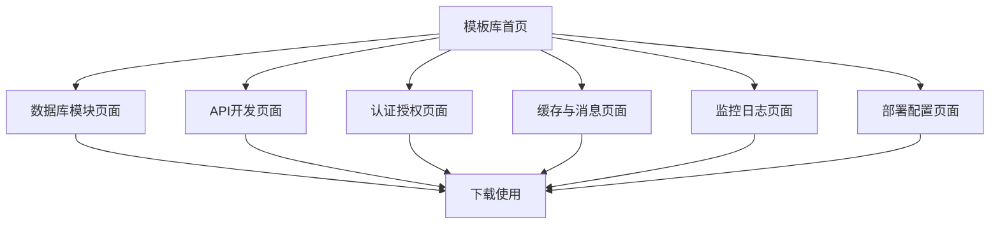

# Python后端开发功能组件模板库产品需求文档

## 1. 产品概述

本项目旨在构建一个全面、强大的Python后端开发功能组件模板库，为开发者提供开箱即用的高质量代码模板，显著提升开发效率和代码质量。

该模板库将涵盖Python后端开发中的核心功能模块，包括数据库操作、API开发、认证授权、缓存管理、消息队列等关键组件，帮助开发者快速构建稳定可靠的后端服务。

通过标准化的模板设计，该库将成为Python后端开发的最佳实践参考，为企业级应用开发提供坚实的技术基础。

## 2. 核心功能

### 2.1 用户角色

| 角色 | 使用方式 | 核心权限 |
|------|----------|----------|
| Python开发者 | 直接下载使用模板 | 可访问所有模板代码，进行定制化开发 |
| 架构师 | 参考架构设计 | 可查看完整架构文档，了解最佳实践 |
| 团队负责人 | 制定开发规范 | 可基于模板库建立团队开发标准 |

### 2.2 功能模块

我们的Python后端模板库包含以下核心页面：

1. **模板库首页**：项目介绍、快速开始指南、模板分类导航
2. **数据库模块页面**：ORM模板、数据库连接池、迁移脚本模板
3. **API开发页面**：RESTful API模板、GraphQL模板、API文档生成
4. **认证授权页面**：JWT认证、OAuth2.0、权限控制模板
5. **缓存与消息页面**：Redis缓存、消息队列、异步任务模板
6. **监控日志页面**：日志记录、性能监控、错误追踪模板
7. **部署配置页面**：Docker配置、CI/CD模板、环境配置管理

### 2.3 页面详情

| 页面名称 | 模块名称 | 功能描述 |
|----------|----------|----------|
| 模板库首页 | 项目介绍区 | 展示项目概述、特性亮点、使用统计 |
| 模板库首页 | 快速开始 | 提供安装指南、基础使用示例、常见问题解答 |
| 模板库首页 | 分类导航 | 按功能分类展示所有模板，支持搜索和筛选 |
| 数据库模块页面 | ORM模板 | 提供SQLAlchemy、Django ORM、Peewee等主流ORM使用模板 |
| 数据库模块页面 | 连接池管理 | 数据库连接池配置、连接管理、性能优化模板 |
| 数据库模块页面 | 数据迁移 | 数据库版本管理、迁移脚本、数据同步模板 |
| API开发页面 | RESTful API | FastAPI、Flask、Django REST framework API开发模板 |
| API开发页面 | GraphQL模板 | Graphene、Strawberry GraphQL服务开发模板 |
| API开发页面 | API文档 | Swagger、OpenAPI文档自动生成和管理模板 |
| 认证授权页面 | JWT认证 | JWT token生成、验证、刷新机制模板 |
| 认证授权页面 | OAuth集成 | 第三方登录、OAuth2.0服务端实现模板 |
| 认证授权页面 | 权限控制 | RBAC权限模型、装饰器权限验证模板 |
| 缓存与消息页面 | Redis缓存 | 缓存策略、分布式缓存、缓存穿透防护模板 |
| 缓存与消息页面 | 消息队列 | Celery、RQ异步任务、消息中间件集成模板 |
| 缓存与消息页面 | 实时通信 | WebSocket、Server-Sent Events实现模板 |
| 监控日志页面 | 日志系统 | 结构化日志、日志轮转、分布式日志收集模板 |
| 监控日志页面 | 性能监控 | APM集成、性能指标收集、告警机制模板 |
| 监控日志页面 | 错误追踪 | 异常处理、错误上报、调试信息收集模板 |
| 部署配置页面 | 容器化部署 | Docker镜像构建、docker-compose配置模板 |
| 部署配置页面 | CI/CD流程 | GitHub Actions、GitLab CI自动化部署模板 |
| 部署配置页面 | 配置管理 | 环境变量管理、配置文件模板、密钥管理 |

## 3. 核心流程

**开发者使用流程：**
开发者首先访问模板库首页了解项目概况，然后根据需求浏览特定功能模块页面，选择合适的模板进行下载和定制化开发。每个模板都包含完整的代码示例、配置文件和使用文档。

**模板集成流程：**
开发者可以通过包管理器安装模板，或直接复制代码到项目中。模板支持模块化集成，可以单独使用某个功能组件，也可以组合多个模板构建完整的后端服务。

## 4. 用户界面设计

### 4.1 设计风格

- **主色调**：深蓝色(#1e3a8a)作为主色，浅蓝色(#3b82f6)作为辅助色
- **按钮样式**：圆角矩形按钮，支持悬停效果和点击反馈
- **字体设计**：主标题使用18-24px，正文使用14-16px，代码使用等宽字体
- **布局风格**：卡片式布局，清晰的模块分割，响应式设计
- **图标风格**：使用简洁的线性图标，配合适当的代码相关emoji如🐍、⚡、🔧

### 4.2 页面设计概览

| 页面名称 | 模块名称 | UI元素 |
|----------|----------|--------|
| 模板库首页 | 项目介绍区 | 大标题横幅、特性卡片网格、统计数据展示 |
| 模板库首页 | 快速开始 | 步骤式引导、代码示例框、复制按钮 |
| 模板库首页 | 分类导航 | 分类标签、搜索框、模板卡片列表 |
| 数据库模块页面 | ORM模板 | 代码编辑器样式展示、下载按钮、使用说明折叠面板 |
| API开发页面 | RESTful API | 接口示例、参数表格、响应格式展示 |
| 认证授权页面 | JWT认证 | 流程图、配置示例、安全提示框 |
| 缓存与消息页面 | Redis缓存 | 架构图、性能对比图表、配置代码块 |
| 监控日志页面 | 日志系统 | 日志格式示例、配置向导、集成指南 |
| 部署配置页面 | 容器化部署 | Dockerfile展示、命令行示例、部署流程图 |

### 4.3 响应式设计

采用移动优先的响应式设计策略，支持桌面端、平板和移动设备访问。桌面端优化代码阅读体验，移动端重点优化导航和搜索功能。